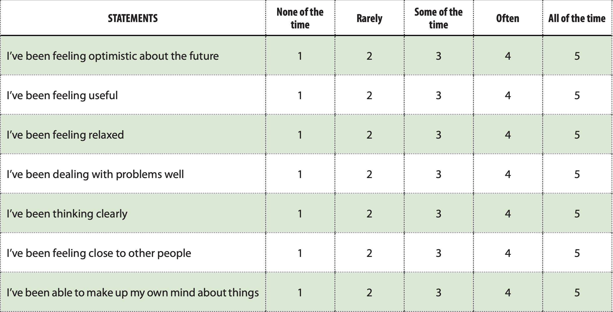

# Warwick–Edinburgh Mental Wellbeing Scale (WEMWBS)

The WEMWBS was developed to enable the monitoring of mental wellbeing in the general population and the evaluation of projects, programmes and policies which aim to improve mental wellbeing. The SWEMWBS uses seven of the WEMWBS’s 14 statements about thoughts and feelings, which relate more to functioning than feelings and so offer a slightly different perspective on mental wellbeing. The seven statements are positively worded with five response categories from ‘none of the time’ to ‘all of the time’. Children and young people are asked to describe their experiences over the past two weeks. Although the WEMWBS was not designed to monitor mental wellbeing at an individual level, research (in adults) suggests that the WEMWBS could detect clinically meaningful change

